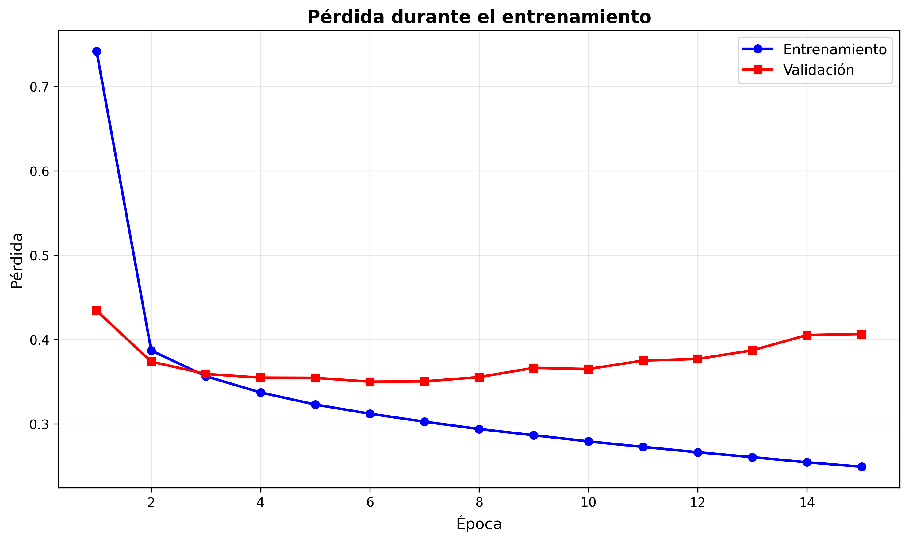
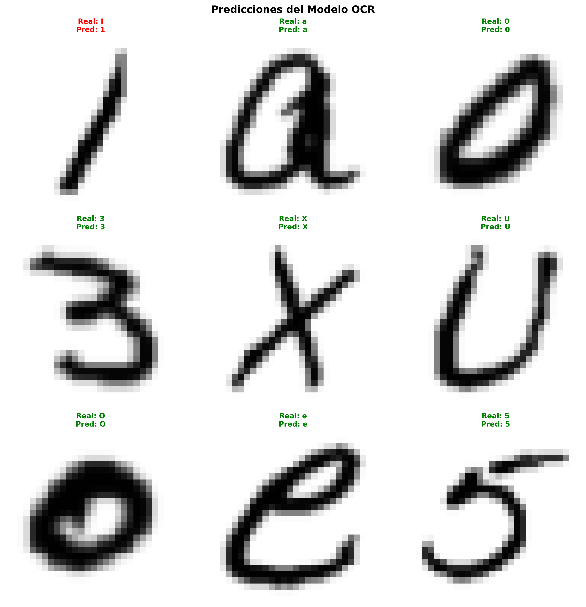

# 🔤 Sistema OCR - Reconocimiento de Caracteres Manuscritos

**Trabajo Final de la asignatura - Inteligencia Artificial curso 2024-2025**

Sistema de OCR implementado desde cero para reconocer texto manuscrito.

---

## 📋 Resumen del Proyecto

### Objetivo
Desarrollar un sistema OCR capaz de reconocer caracteres manuscritos individuales y palabras completas sin usar bibliotecas especializadas de OCR (como Tesseract).

### Funcionalidades Implementadas

#### ✅ Obligatorias
- **Reconocimiento de caracteres manuscritos**: Letras (A-Z, a-z), números (0-9) y caracteres españoles (Ñ, ñ)
- **Reconocimiento de palabras**: Segmentación automática y predicción letra por letra
- **Arquitectura CNN propia**: Red neuronal convolucional entrenada desde cero
---

## 🏗️ Arquitectura

### Modelo CNN

```
Input (1, 28, 28)
     ↓
Conv2d(1→32) + ReLU + BatchNorm + MaxPool + Dropout(0.3)
     ↓
Conv2d(32→64) + ReLU + BatchNorm + MaxPool + Dropout(0.3)
     ↓
Conv2d(64→96) + ReLU + BatchNorm + MaxPool + Dropout(0.3)
     ↓
Flatten → 864
     ↓
Linear(864→320) + ReLU + Dropout(0.5)
     ↓
Linear(320→160) + ReLU + Dropout(0.5)
     ↓
Output: 62 clases (0-9, A-Z, a-z)
```

**Hiperparámetros:**
- Optimizador: Adam (lr=0.001)
- Función de pérdida: CrossEntropyLoss
- Batch size: 128
- Épocas: 15

---

## 📊 Datasets Utilizados

### 1. Dataset Custom (Manuscrito)
- **Fuente**: Caracteres manuscritos de compañeros de clase
- **Clases**: 64 (incluye Ñ y ñ)
- **Total**: ~4,500 imágenes
- **División**: 80% entrenamiento, 20% validación

### 2. EMNIST (Extended MNIST)
- **Fuente**: Dataset público de caracteres manuscritos
- **Clases**: 62 (sin Ñ ni ñ)
- **Total**: ~700,000 imágenes
- **Uso**: Entrenamiento combinado para mejorar generalización

### Preprocesamiento
- Conversión a escala de grises
- Redimensionamiento a 28×28 píxeles
- Normalización (media=0.5, desv=0.5)
- Binarización (fondo negro, letra blanca)

---

## 📈 Resultados

### Precisión Alcanzada
- **Caracteres individuales**: 60-70%
- **Palabras simples**: Funcional (ejemplo: "sock" reconocido correctamente)

### Análisis del Entrenamiento

|  Gráficas | Imagen |
|------|------|
| Gráfica de entrenamiento| |
| Predicciones| |

**Observaciones:**
- Aprendizaje efectivo hasta época 8
- Overfitting leve detectado después de época 8
- Val loss mínimo: 0.35 (época 8)

---

## 🚀 Uso del Sistema

### Instalación

```bash
# 1. Crear entorno virtual
python -m venv venv
venv\Scripts\activate  # Windows

# 2. Instalar dependencias
pip install -r requirements.txt
```

### Predicción de Caracteres

```bash
python inference/predict_char.py \
    --image test_char.png \
    --model models/weights/modelo_final.pth
```

### Predicción de Palabras

```bash
python inference/predict_word.py \
    --image test_word.png \
    --model models/weights/modelo_final.pth
```

---

## 📁 Estructura del Código

```
ocr_proyecto/
├── models/             # Arquitectura del modelo
│   ├── config.py       # Configuración y mapeos
│   ├── cnn.py          # Red CNN
│   └── ocr_model.py    # Wrapper para inferencia
│
├── datasets/            # Carga de datos
│   ├── normalized_dataset.py
│   └── combined_dataset.py
│
├── training/            # Scripts de entrenamiento
│   └── train_custom_emnist.py
│
├── inference/           # Scripts de predicción
│   ├── predict_char.py
│   └── predict_word.py
│
├── segmentation/        # Segmentación
│   ├── word_segmentation.py
│   └── letter_segmentation.py
│
├── extras/              # Funcionalidades opcionales
│   ├── detect_tables.py
│   └── detect_figures.py
│
└── utils/               # Utilidades
    ├── image_utils.py
    └── viz.py
```

---

## 🔧 Tecnologías Utilizadas

### Bibliotecas Principales
- **PyTorch 2.6.0**: Framework de deep learning
- **OpenCV 4.8.0**: Procesamiento de imágenes
- **NumPy 2.1.0**: Computación científica
- **Matplotlib 3.7.0**: Visualización

### ⚠️ Restricciones Cumplidas
- **NO se usó**: Tesseract, EasyOCR, Google Vision API, o similares
- ✅ **Solo se usó**: PyTorch (framework general), OpenCV (procesamiento básico)
- ✅ **Implementación propia**: Toda la lógica de OCR, segmentación y reconocimiento

---

##  Conclusiones

### Logros
1. Sistema funcional de OCR manuscrito con ~60-70% de precisión
2. Arquitectura CNN implementada y entrenada desde cero
3. Segmentación automática de palabras y letras
4. Soporte para caracteres españoles (Ñ, ñ)

### Limitaciones Actuales
1. Overfitting detectado después de época 8
2. Documentos completos requieren optimización adicional
3. Precisión limitada con datasets pequeños

### Mejoras Futuras
1. **Early stopping**: Implementar parada automática en época 8-10
2. **Data augmentation**: Aumentar variabilidad del dataset
3. **Post-procesamiento**: Corrección ortográfica y diccionarios
4. **Modelos transformer**: Explorar arquitecturas más avanzadas

---

## 📚 Referencias

1. **EMNIST**: Cohen, G., et al. (2017). "EMNIST: Extending MNIST to handwritten letters"
2. **PyTorch**: Framework de deep learning - https://pytorch.org
3. **OpenCV**: Biblioteca de visión por computadora - https://opencv.org

---

<div align="center"> <p style="font-size: 0.9em; color: #666;"> 2025 Sistema OCR - Reconocimiento de Caracteres Manuscritos. Creado por Natalia Cruz.

Trabajo Final de la asignatura - IA 2025/2026.
</p>
</div>
